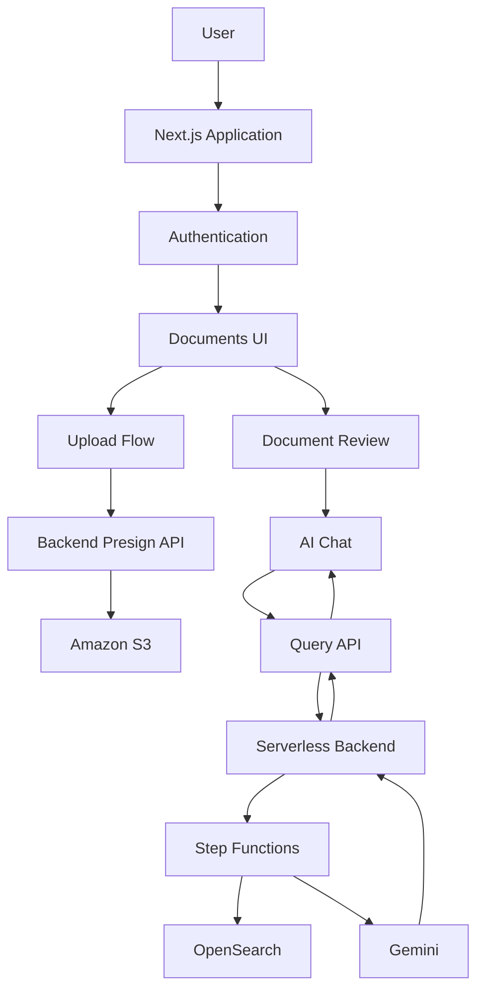
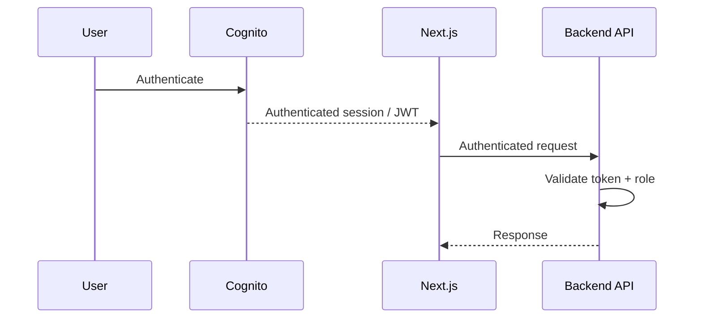
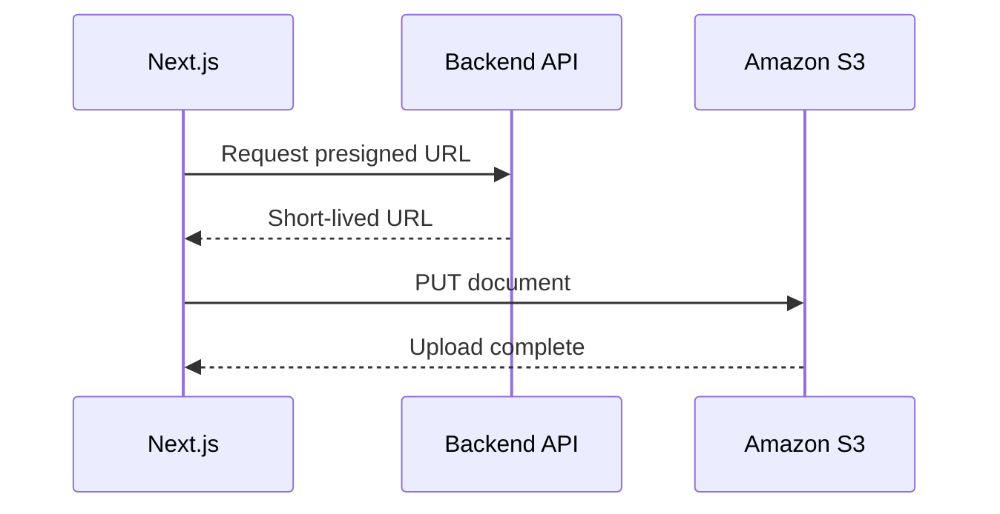
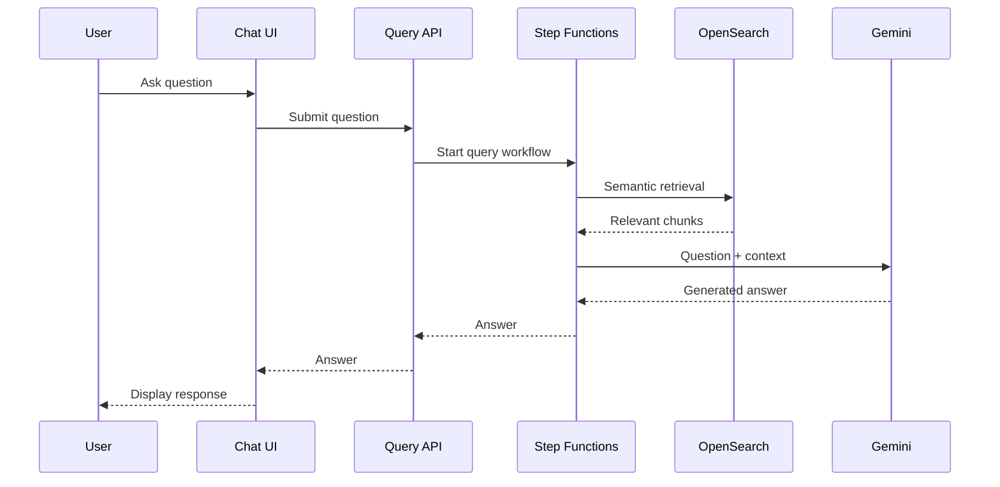

# Frontend Architecture

## 1. Overview

The frontend is a Next.js application responsible for the user-facing experience of the AI Document Intelligence Platform.

Its primary responsibilities are:

* Authentication/session handling.
* Document listing and management.
* Secure upload initiation.
* Direct S3 uploads.
* Document review.
* Chat/question submission.
* Rendering AI responses.
* Communicating processing and error states.

Infrastructure concerns such as document processing, vector retrieval, and LLM orchestration remain in the backend.

---

# 2. Application Architecture



---

# 3. Authentication

Amazon Cognito provides the identity layer.



The frontend handles:

* Authentication flow.
* Authenticated application state.
* Role-aware presentation.
* Authenticated API requests.

The backend remains responsible for final authorization.

---

# 4. Document Upload

The browser does not send the PDF through the Next.js application server.



The benefits include:

* Reduced API payload pressure.
* Reduced application-server bandwidth.
* Faster transfer path for large files.
* No AWS credentials exposed to the browser.

---

# 5. Document Lifecycle

From the frontend perspective:

```text
Select Document
      ↓
Request Upload URL
      ↓
Upload to S3
      ↓
Processing
      ↓
Document Status Updated
      ↓
Document Available
      ↓
Review / Ask Questions
```

Document processing occurs asynchronously in the backend.

The frontend should therefore treat processing status as state rather than assuming the document is immediately ready after upload.

---

# 6. Document Review

The document review experience is responsible for:

* Displaying available documents.
* Showing processing state.
* Selecting a document.
* Providing access to document-specific AI interactions.

The frontend communicates with backend APIs instead of directly accessing DynamoDB or OpenSearch.

This maintains a clean application boundary:

```text
Next.js
   ↓
Backend API
   ↓
AWS infrastructure
```

rather than:

```text
Next.js
   ↓
DynamoDB / OpenSearch / S3 directly
```

---

# 7. AI Chat Architecture

The chat interface connects to the backend RAG pipeline.



The frontend does not need to know the internal retrieval implementation.

This provides a useful abstraction:

```text
Chat UI
   ↓
Query API
   ↓
Retrieval + AI
```

The backend can therefore evolve independently.

---

# 8. State Management

Frontend state should be separated into three major categories.

## UI State

Examples:

* Selected document.
* Modal visibility.
* Active chat mode.
* Input values.
* Loading indicators.

## Server State

Examples:

* Document list.
* Document status.
* Document details.
* Query responses.

## Authentication State

Examples:

* Current user.
* Authentication status.
* User role.

Separating these concerns reduces unnecessary component coupling and makes the application easier to evolve.

---

# 9. Error Handling

The frontend should distinguish between different classes of failures.

### Upload errors

Examples:

```text
Unable to generate upload URL
Upload failed
Invalid document
```

### Processing errors

Examples:

```text
Document validation failed
Document processing failed
```

### Query errors

Examples:

```text
Unable to retrieve document context
AI service unavailable
Question processing failed
```

Errors should provide an actionable message to the user rather than exposing raw infrastructure errors.

---

# 10. Loading & Processing States

Because document processing and AI generation are asynchronous, the UI should communicate state clearly.

A typical document lifecycle can be represented as:

```text
Uploading
    ↓
Processing
    ↓
Ready
```

or:

```text
Uploading
    ↓
Processing
    ↓
Failed
```

Similarly, AI interactions can expose:

```text
Submitting question
        ↓
Retrieving context
        ↓
Generating answer
        ↓
Answer ready
```

These states improve perceived reliability and make distributed backend processing understandable to the user.

---

# 11. Performance

Important frontend performance considerations include:

### Code Splitting

Load non-critical functionality only when required.

### Client Components

Use client-side components where interaction requires them rather than making the entire application client-rendered.

### API Efficiency

Avoid duplicate requests and unnecessary refetching.

### Caching

Stable document metadata and other server state can be cached appropriately.

### AI Responses

Streaming generated responses can improve perceived latency by allowing users to see content before the entire generation completes.

### Measurement

Frontend performance should be measured separately from backend latency.

```text
Browser → API
       +
Backend retrieval
       +
LLM generation
```

This makes it easier to identify the actual bottleneck.

---

# 12. Security Boundary

The frontend may implement role-aware UI:

```text
Role
 ↓
Show / hide UI
```

But actual authorization must happen here:

```text
Request
 ↓
API
 ↓
JWT validation
 ↓
Role validation
 ↓
Document authorization
 ↓
Operation
```

This prevents users from bypassing frontend restrictions by directly calling APIs.

---

# 13. Accessibility

The application should provide:

* Keyboard-accessible controls.
* Semantic HTML.
* Visible focus states.
* Accessible form labels.
* Meaningful button labels.
* Screen-reader-friendly loading states.
* Accessible error messages.
* Appropriate empty states.

This is particularly important for interactive document and chat interfaces.

---

# 14. Backend Separation

The frontend intentionally does not directly manage:

* DynamoDB.
* OpenSearch.
* Step Functions.
* Lambda execution.
* AI provider credentials.
* AWS IAM permissions.

Instead:

```text
Next.js
   ↓
Application APIs
   ↓
Serverless backend
   ↓
AWS infrastructure
```

This keeps infrastructure concerns isolated from the presentation layer.

---

# 15. Future Frontend Improvements

Potential improvements include:

* Streaming AI responses.
* Optimistic UI updates where appropriate.
* Improved document-processing progress.
* Client-side telemetry.
* Accessibility auditing.
* End-to-end testing.
* Component-level testing.
* Performance monitoring.
* Error tracking.
* Progressive loading for large document lists.

These should be introduced based on measured user experience and application requirements.
