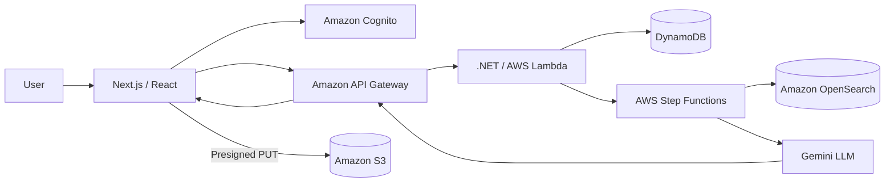
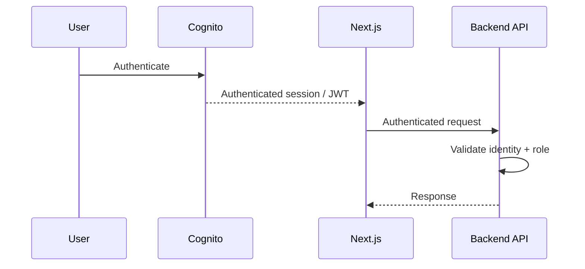
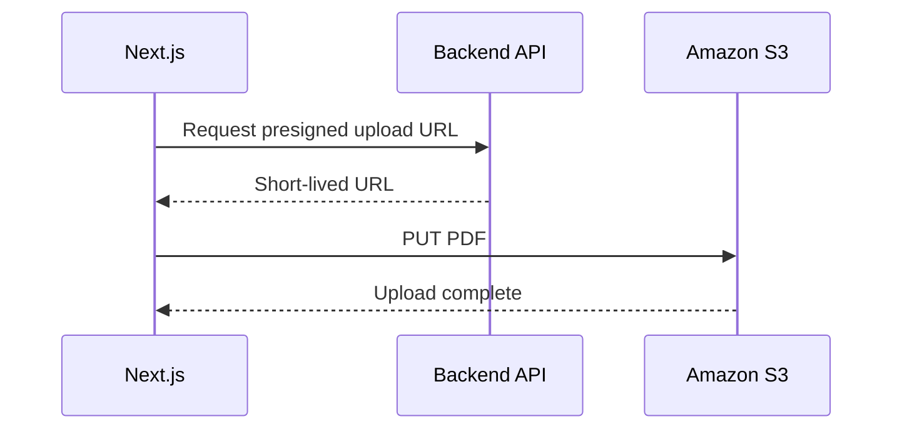

# AI Document Intelligence — Frontend

A production-oriented **Next.js and React frontend** for an AI-powered document intelligence platform.

The application provides authenticated document management, secure document uploads, document review, and an interactive AI question-answering experience backed by a **serverless AWS RAG architecture**.

> This repository contains the frontend application. The serverless backend is maintained separately in [`document-intelligence-system`](https://github.com/sakshigoyal58/document-intelligence-system).

---

## Architecture



The frontend deliberately remains separated from the underlying AWS infrastructure.

The browser interacts with application APIs and secure upload URLs rather than directly managing AWS credentials or search infrastructure.

---

# Key Features

### Authentication & Authorization

* Amazon Cognito authentication.
* JWT-based authenticated API requests.
* Role-aware application experience.
* Protected document operations.

### Document Management

* View uploaded documents.
* Track document processing state.
* Review document information.
* Upload PDF documents securely.

### Secure Uploads

Documents are uploaded directly from the browser to Amazon S3 using short-lived presigned URLs.

```text
Browser
   |
   | Request upload URL
   v
Backend API
   |
   | Presigned URL
   v
Browser
   |
   | PUT PDF
   v
Amazon S3
```

This avoids routing large document payloads through the application server.

### AI Document Q&A

The frontend provides an interactive chat experience for asking questions about uploaded documents.

```text
Question
   ↓
Next.js Chat UI
   ↓
Backend API
   ↓
AWS Step Functions
   ↓
OpenSearch Vector Retrieval
   ↓
Relevant Document Context
   ↓
Gemini
   ↓
Generated Answer
   ↓
Next.js
```

---

# Technology Stack

| Area           | Technology         |
| -------------- | ------------------ |
| Framework      | Next.js            |
| UI             | React              |
| Language       | TypeScript         |
| Styling        | Tailwind CSS       |
| Authentication | Amazon Cognito     |
| API            | Amazon API Gateway |
| Storage        | Amazon S3          |
| Backend        | .NET / AWS Lambda  |
| Metadata       | Amazon DynamoDB    |
| Search         | Amazon OpenSearch  |
| Orchestration  | AWS Step Functions |
| AI             | Gemini             |

---

# Application Flow

## 1. Authentication



Amazon Cognito is responsible for identity.

The frontend is responsible for the authenticated user experience, while backend services remain responsible for authorization.

---

# 2. Document Upload

The upload architecture is intentionally optimized for large files.



The PDF does not need to pass through the Next.js application server.

This reduces unnecessary server-side bandwidth and keeps AWS credentials out of the browser.

---

# 3. Document Review

The application provides a document-focused UI where users can:

* View available documents.
* See document processing status.
* Select a document for review.
* Start an AI question-answering interaction.

The frontend consumes document metadata through backend APIs rather than accessing DynamoDB directly.

---

# 4. AI Chat

The chat experience connects the user to the backend RAG pipeline.

```text
User
 ↓
Chat UI
 ↓
Query API
 ↓
Step Functions
 ↓
Gemini Embedding
 ↓
OpenSearch Vector Search
 ↓
Relevant Chunks
 ↓
Gemini
 ↓
Answer
 ↓
Chat UI
```

The frontend is intentionally decoupled from the retrieval implementation.

This means the UI does not need to know whether retrieval is implemented using OpenSearch, another vector database, or a future retrieval service.

---

# Frontend Architecture Principles

## Separation of concerns

The frontend focuses on:

```text
Presentation
User interaction
Client state
Authentication experience
API communication
```

Infrastructure responsibilities remain in the backend:

```text
AWS resources
Document processing
Vector indexing
Retrieval
LLM orchestration
Authorization
```

---

## Backend as the security boundary

Frontend checks can improve UX, but they are not security controls.

For example, hiding an upload or document-management button for a particular role does not prevent a malicious user from manually invoking an API.

Therefore:

```text
Frontend
   ↓
UX-level role checks

Backend
   ↓
Actual authorization
```

---

# Performance Considerations

The frontend is designed around APIs and asynchronous processing rather than assuming document operations complete immediately.

Important considerations include:

### Loading states

Document processing and AI requests may take time, so the UI should communicate states such as:

```text
Uploading
Processing
Ready
Failed
Generating answer
```

### API efficiency

Avoid unnecessary API requests and duplicate fetching of stable document metadata.

### Code splitting

Non-critical UI can be loaded lazily to reduce the initial JavaScript payload.

### AI response experience

For production use, streaming AI responses can improve perceived latency by allowing users to see the answer as it is generated instead of waiting for the complete response.

---

# State Management

Frontend state can be divided into three categories.

### UI State

Examples:

* Modal visibility.
* Selected document.
* Active chat mode.
* Input state.
* Loading indicators.

### Server State

Examples:

* Document list.
* Processing status.
* Document details.
* Query results.

### Authentication State

Examples:

* Current user.
* Authentication status.
* User role.

Keeping these concerns separate prevents unnecessary coupling between UI components and backend data.

---

# Security

The frontend follows several important security principles:

* Authentication is handled through Amazon Cognito.
* Protected API requests use authenticated identity information.
* AWS credentials are never exposed to the browser.
* S3 uploads use short-lived presigned URLs.
* Authorization is ultimately enforced by backend services.
* Secrets and API keys are not stored in source control.

---

# Accessibility & UX

A production-quality document and chat experience should provide:

* Keyboard-accessible controls.
* Clear focus states.
* Semantic HTML.
* Accessible form labels.
* Descriptive loading states.
* Actionable error messages.
* Appropriate empty states.
* Clear document-processing feedback.

---

# Backend

The backend repository contains the AWS serverless implementation:

**document-intelligence-system**

It is responsible for:

* .NET Lambda APIs.
* API Gateway integration.
* S3 processing.
* DynamoDB metadata.
* SQS-based asynchronous processing.
* OpenSearch indexing and retrieval.
* Step Functions orchestration.
* Gemini integration.
* Backend authorization.

See the backend repository's `README.md` and `ARCHITECTURE.md` for the complete system architecture.

---

# Project Structure

The application follows the Next.js App Router architecture.

The codebase is organized around application routes, reusable UI components, API/service integration, state, and shared types.

A typical high-level structure is:

```text
app/
components/
lib/
services/
state/
types/
public/
```

The exact organization should evolve with the application while keeping UI, state, service integration, and shared models clearly separated.

---

# Getting Started

Install dependencies:

```bash
npm install
```

Start the development server:

```bash
npm run dev
```

Open:

```text
http://localhost:3000
```

The application requires the corresponding authentication, API, and AWS configuration used by the backend environment.

Do not commit secrets or production credentials.

---

# Environment Configuration

Use environment variables for environment-specific configuration.

A local environment file can contain values such as:

```text
NEXT_PUBLIC_...
COGNITO_...
API_...
```

Never commit actual credentials, API keys, or secrets to Git.

---

# Related Repository

### Backend

`document-intelligence-system`

Together, the two repositories form the complete AI Document Intelligence Platform.

---

# Project Highlights

This project demonstrates experience across:

* React
* Next.js
* TypeScript
* .NET
* AWS
* Serverless architecture
* Event-driven systems
* Authentication and RBAC
* Secure file uploads
* Vector search
* RAG
* AI/LLM integration
* Distributed workflows
* API design
* Full-stack architecture

It is designed as a reference implementation demonstrating how a modern full-stack application can combine a React/Next.js experience with an event-driven AWS backend and AI-powered retrieval.
